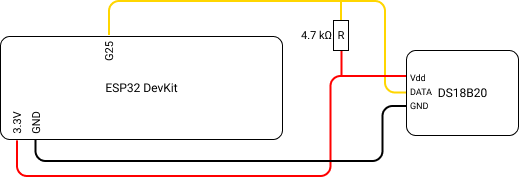
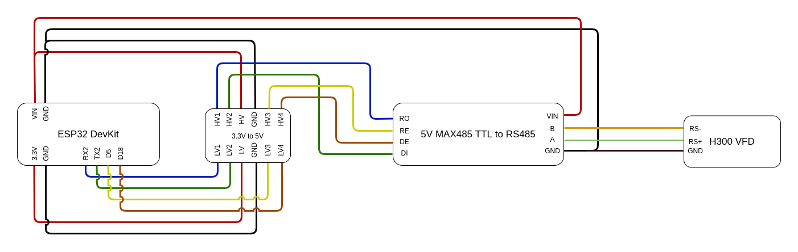

# websocket-module

## Developing

1. Rename `config (TEMPLATE).h` to `config.hpp` with correct settings

1. In `main.ino` create all devices and add them to device list

1. To use ESP32 with arduino IDE follow this manual:
   https://docs.espressif.com/projects/arduino-esp32/en/latest/installing.html
   arduino.additionalUrls

   **Or** use VSCode (recommended for better IntelliSense) with Arduino extension (needs similar config as Arduino IDE)

1. Use ESP32 Dev Module as selected board. Dont forget to set correct COM port.

1. Update `c_cpp_properties.json` with your path

   ```json
   "env": {
      "pathToArduino": "your\\path\\to\\arduino",
      "pathToLib": "your\\path\\to\\lib"
   },
   ```

1. Install libraries

- ArduinoJson by Benoit Blanchon
- WebSockets by Markus Sattler
- ESP32Servo by John K.
- OneWire by Jim Studt
  - IMPORTANT: to fix 'rtc\_gpio\_desc' error visit: https://githubmemory.com/repo/PaulStoffregen/OneWire/issues/100
    **or** _Find 'rtc\_gpio\_desc' replace with 'rtc\_io\_desc' in the 'OneWire\_direct\_gpio.h' file solved the issue_
- ModbusMaster (2.0.1) from https://www.arduino.cc/reference/en/libraries/modbusmaster/
- Arduino-Temperature-Control-Library from https://github.com/milesburton/Arduino-Temperature-Control-Library

## Debugging help

Error during upload to **some** ESP boards - TIMED_OUT - press (1 sec) BOOT button on ESP during upload
https://randomnerdtutorials.com/solved-failed-to-connect-to-esp32-timed-out-waiting-for-packet-header/

## Schemas



_\*With DS18B20 you can add multiple sensors to same pins because OneWire_



_\*With H300 we also had to add 1k resistors between A-VIN and B-GND_
